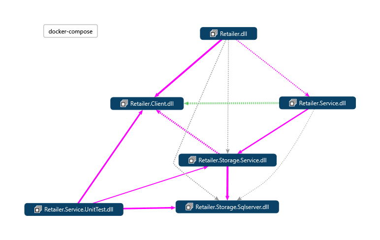

## Alicunde.Retailer
### Description
#### Tech Stack
- .NET 9 preview (scheduled for release in November 2024)
- AutoMapper
- CQRS pattern
- Docker
    - Minimal API
    - Redis
    - SQL Server
- Entity Framework
- Fluent Validation
- GitHub Actions
- Health checks
- Jwt Auth setup
- MediatR
- Moq
- Open API
- Query parameter api versioning: api-version=1.0
- Refit

This solution does not include Swagger, but you can view the API documentation at http://localhost:9080/openapi/v1.json. 
Microsoft has decided to discontinue support for Swagger in .NET 9. 
For more details and alternatives, refer to the following link: [https://github.com/dotnet/aspnetcore/issues/54599](https://github.com/dotnet/aspnetcore/issues/54599)

### Environment variables
- ALICUNDE_RETAILER_SQL_MIGRATIONS
    - Sql connection string for running migrations (localhost)
- ALICUNDE_RETAILER_SQL_SERVICE
    - Sql connection string for the service inside docker compose(storage-sqlserver)
- CORS__ORIGIN
    - Allowed origins (localhost)
- REDIS_CACHE
    - Redis connection string (redis-cache)
- MSSQL_SA_PASSWORD
    - SQL Server sa password

### Running db migrations
1. Restore/Build the solution
2. Ensure sql docker-compose is running
3. Using visual studio, open the package manager console
4. Run the following command:
    `Update-Database`

### Running the Project
1. Install Docker
2. Create the network by running the following command:
    `docker network create alicunde-network`
3. Navigate to the docker-compose.yml container folder and run `docker-compose up --build`
4. Open your browser and navigate to [http://localhost:9080/openapi/v1.json](http://localhost:9080/openapi/v1.json) to access the API documentation.
5. Use Reatiler.http file located in src/Reatiler to test the API.

### Code diagram
